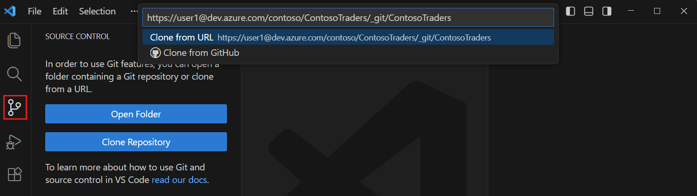

# 从零搭建 DjangoBlog：VSCode + Git + GitHub 完整指南

本文记录从零开始搭建 DjangoBlog 博客系统的完整流程，涵盖开发环境准备、Git 配置、从 GitHub 克隆仓库、依赖安装、数据库配置以及项目启动。照着一步步做，就能在自己的电脑上跑起这套博客。

## 一、环境要求

开始之前，请确保电脑上已经安装好以下软件：

| 软件 | 版本要求 | 作用 |
|---|---|---|
| Python | 3.10 及以上 | 运行 Django 后端 |
| MySQL / MariaDB | 5.7 及以上 | 数据库 |
| Node.js | 18 及以上 | 构建前端资源 |
| Git | 任意较新版本 | 版本控制、克隆仓库 |

在终端里可以用下面的命令确认版本：

```bash
python --version
node --version
npm --version
git --version
```

## 二、安装并配置 VSCode

1. 到官网下载安装 [Visual Studio Code](https://code.visualstudio.com/)。
2. 装好后，安装几个对 Python 开发很有用的扩展：
   - **Python**（微软官方）
   - **Pylance**（代码智能提示）
   - **GitLens**（Git 可视化）
   - **Django**（模板语法高亮）

安装扩展的方法：点击左侧活动栏的「扩展」图标（或按 `Ctrl + Shift + X`），搜索扩展名后点「安装」。

## 三、配置 Git

首次使用 Git 需要设置用户名和邮箱，这些信息会记录在每次提交里：

```bash
git config --global user.name "你的名字"
git config --global user.email "你的邮箱"
```


## 四、在 VSCode 里打开终端

先打开 VSCode，然后在 VSCode 内部打开集成终端，快捷键是：

```
Ctrl + `
```

> 也就是 **Ctrl + 反引号**（键盘上 `1` 左边、`Tab` 上方的那个键 `\``）。
> 中文键盘上这个键往往要配合 Shift，所以实际按的是 **Ctrl + Shift + `**。
> 也可以直接用菜单：**终端（Terminal）→ 新建终端（New Terminal）**。

打开后，终端会出现在 VSCode 底部，默认就在当前文件夹目录下。

## 五、用 git clone 克隆仓库

1.打开源代码控制视图（Ctrl+Shift+G），选择克隆仓库



或者，打开命令面板（Ctrl+Shift+P）并输入。Git: Clone

2.输入仓库网址（例如，https://github.com/microsoft/PowerToys)
如果你是从 GitHub 克隆，也可以选择“从 GitHub 克隆”，登录你的 GitHub 账户查看你的仓库列表。

3.选择电脑上的父文件夹来保存项目

4.当提示打开 VS Code 中的克隆仓库时，选择打开

## 六、创建虚拟环境（推荐）

在项目根目录创建并激活虚拟环境，避免依赖污染全局环境：

```bash
# Windows
python -m venv venv
venv\Scripts\activate

# macOS / Linux
python3 -m venv venv
source venv/bin/activate
```

激活成功后，终端提示符前面会出现 `(venv)`。

## 七、安装依赖（requirements.txt）

项目根目录的 `requirements.txt` 列出了所有 Python 依赖，直接安装：

```bash
pip install -r requirements.txt
```

主要依赖包括：

- Django —— Web 框架
- mysqlclient —— MySQL 数据库驱动
- django-compressor —— 静态资源压缩
- django-haystack + Whoosh —— 全文搜索
- elasticsearch —— 可选的 ES 搜索引擎
- django-mdeditor —— Markdown 编辑器

## 八、创建数据库并配置连接

先在 MySQL 里创建数据库：

```sql
CREATE DATABASE `djangoblog` DEFAULT CHARACTER SET utf8mb4 COLLATE utf8mb4_unicode_ci;
```

然后打开 `djangoblog/settings.py`，找到 `DATABASES` 配置，改成你自己的连接信息：

```python
DATABASES = {
    'default': {
        'ENGINE': 'django.db.backends.mysql',
        'NAME': 'djangoblog',        # 数据库名
        'USER': 'root',              # 账号
        'PASSWORD': '你的密码',        # 密码
        'HOST': '127.0.0.1',
        'PORT': 3306,
        'OPTIONS': {'charset': 'utf8mb4'},
    }
}
```

## 九、初始化数据库

依次执行迁移命令，Django 会自动在数据库里建好所有表：

```bash
python manage.py makemigrations
python manage.py migrate
```

接着创建超级管理员账号（用于登录后台）：

```bash
python manage.py createsuperuser
```

按提示输入用户名、邮箱和密码即可。

## 十、构建前端资源

前端使用 Vite 构建，需要先安装 npm 依赖再打包：

```bash
cd frontend
npm install
npm run build
cd ..
```

构建产物会输出到 `blog/static/blog/dist/`。最后收集一下静态文件：

```bash
python manage.py collectstatic --noinput
```

## 十一、启动项目

```bash
python manage.py runserver
```

浏览器打开 `http://127.0.0.1:8000/` 就能看到首页，后台管理在 `http://127.0.0.1:8000/admin/`。

## 十二、Git 日常操作

修改代码后，把改动提交并推送到远程仓库：

```bash
git status                 # 查看改动
git add .                  # 暂存所有改动
git commit -m "修改说明"     # 提交
git push origin main       # 推送
```

拉取远程最新代码：

```bash
git pull origin main
```

## 十三、GitHub 协作

- **Fork**：点击仓库右上角 Fork，把项目复制到自己的账号下。
- **Issue**：遇到问题或提建议，在 Issues 页面新建。
- **Pull Request**：在分支上改完代码后，提交 PR 给原作者合并。

## 结语

至此，一套完整的 DjangoBlog 就从零跑起来了。后续可以继续探索后台的站点配置、主题配色、插件系统、全文搜索等功能。

> 小提示：改了 `settings.py` 或站点配置后，记得执行 `python manage.py clear_cache` 清缓存，否则改动可能不会立即生效。
